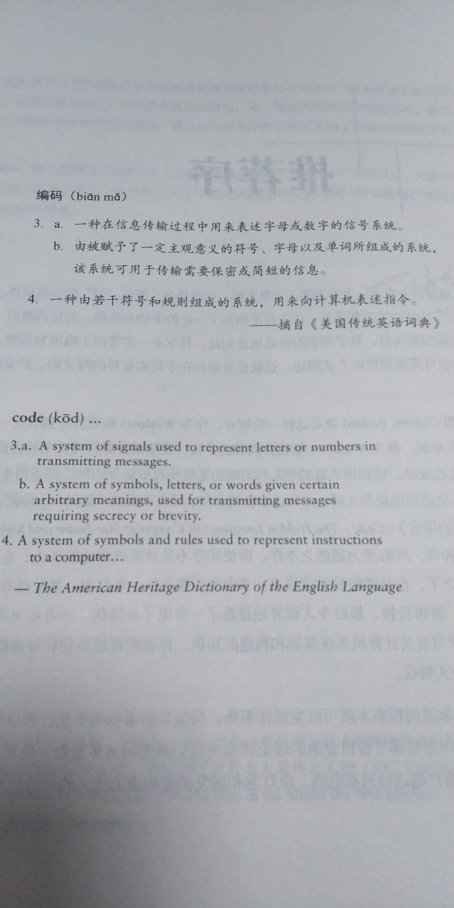
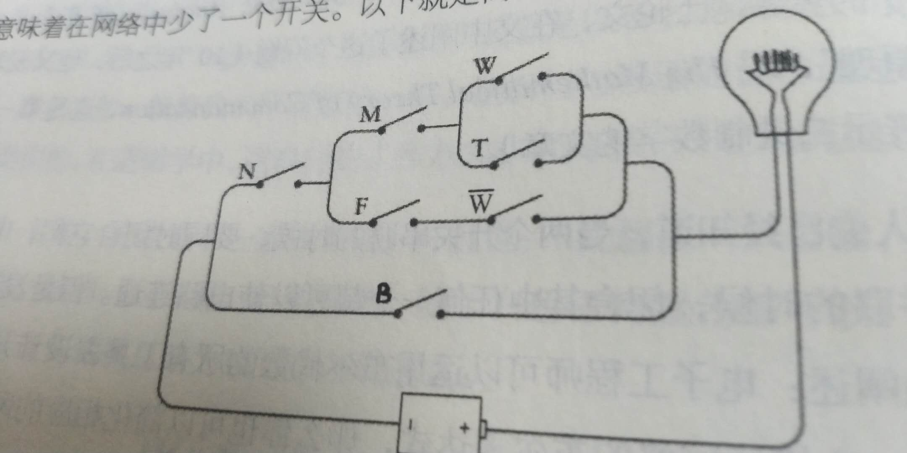
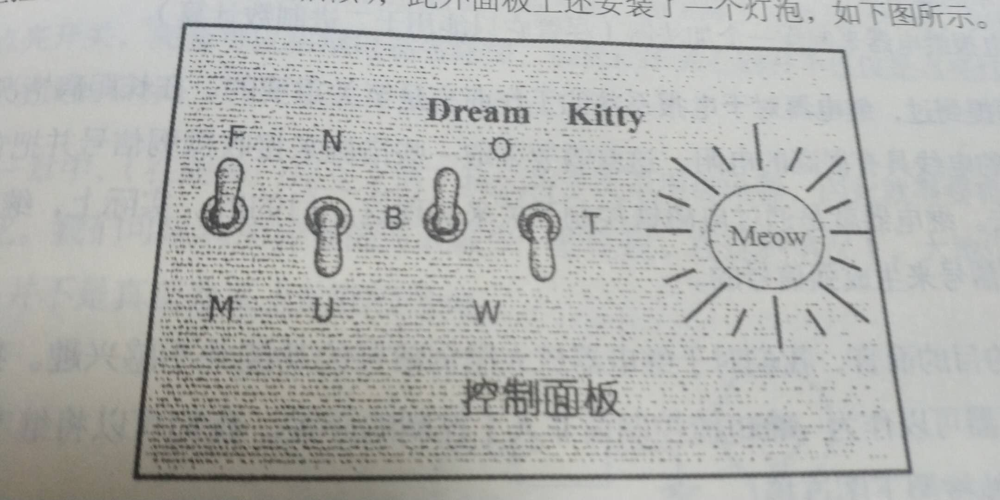

“这本书其实是讲述计算机如何工作的”  

  
遇到的基础问题：  
1. 存储器和内存区别  
2. Mac程序为何不能再Win上运行  
  
首先提到了[摩尔斯电码](莫尔斯电码.md)    

然后是[布莱叶盲文](布莱叶盲文.md)  

接着是[电基础](电基础.md)

从电基础引出电磁铁，然后就可以搭建继电器 

>第一句电报机的信息是，"What hath God wrought"    

而电路的一切都是开或关、通或者不通的状态，对应了二进制    

>沿用到今天的罗马字符
>有： I V X L C D M  
>对应：1，5，10，50，100，500，1000  

即自成一套二进制数  
>bit是binary digit 的缩略新词   

再回过头结合电路和编码历史，就输出了最开始的二进制编码  
如胶卷的DX编码/ASA等级、[商品的UPC编码](UPC原理.md)    

然后是[代数](代数.md)    

此时我们注意到，    
可以用电路并联、串联实现代数中条件的或、与，  
可以用开关控制来实现具体特征的成立、不成立  

根据代数第二题的条件，  
我们优化后（少一些特征值，可以少一些开关）得到：  
(N x ((M x (W + t)) + (F x (1 - W)))) + B 
可以制作出这样的电路：  

这时候我们可以人为控制面板上的开关，再根据灯泡是否亮起，判断是否符合条件  
但是真正的意图应该是自动进行判断，而自动判断的前提是自动控制开关  
    
这个时候就需要电磁铁再度出场，    
双掷继电器：我们可以将一个普通开关的开/关，联通电路，让电磁铁控制其他开关的开/关 或 关/开（反向器）  
 
再配合电路设计，可以用多个开关控制线路  
这样就引出了逻辑门：  
与门：两个开关都闭合的时候，后续线路才通  
非门：有一个开关闭合，就可以通路  

有了以上基础，我们能设计出这样的电路  
------p124
 

  

  

  

  

