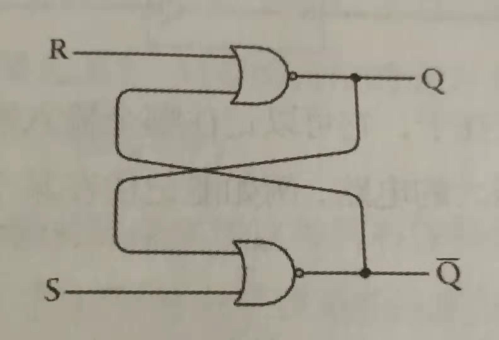

### R-S触发器（reset-set flip-flop）：

触发器的精髓在于，反馈 --- 即组件A的输出是组件B的输入，而组件B的输出又是组件A的输入。

#### 具体分析

我们这里再添加几个标记，左侧 或非门 叫做 组件A， 右侧 或非门 叫做 组件B

组件A的输入计作 ai1，ai2，输出计作 ao，

组件B的输入计作 bi1，bi2，输出计作 bo

我们先设置 **s1 打开**，**s2 打开**

此时 ai2 为0，而不知 ai1，设定

- ai1 为0, 则 ao 为1

  即 bi1 为1，而 bi2 为0，则 bo 为 0，与 ai1 相同，符合设定

- ai1 为1, 则 ao 为 0

  即 bi1 为0，而 bi2 为0，则 bo 为 1，与 ai1 相同，符合设定

故而搭建时的初始态，灯泡可亮可灭，我们取 **灯泡灭 **

为了后续方便，我们合并掉几个相同的名称

ai2 = s1，bi2 = s2，ai1 = bo，bi1 = ao  ( 变化态并不完全相同，只是稳定态相同 )

所以我们现在记录  s1，s2，bo，ao 即可，当前：

| s1   | ao   | s2   | bo   |
| ---- | ---- | ---- | ---- |
| 0    | 1    | 0    | 0    |

- 0100 -> (关s1) 1100 -> 1001
- 1001 -> (开s1) 0001 -> 0001
- 0001 -> (关s2) 0011 -> 0110
- 0110 -> (开s2) 0100 -> 0100

- 0100 -> (关s2) 0110 -> 0110
- 0110 -> (关s1) 1110 -> 1010
- 1010 -> (开s1) 0010 -> 0110 

- 1001 -> (关s2) 1011 -> 1010
- 1010 -> (开s2) 1000 -> 1001

- 0001 -> (关s1) 1001 -> 1001

如此，开关和灯泡的状态皆在记录

书里有个逻辑表，自认是看不出这个结论的：

如果 s1 s2 都是 0 的时候，bo 和 ao 保持之前的状态

如果 s1 s2 都是 1 的时候，bo 和 ao 全部为0

否则

s1 为 1 的时候，bo为 1，ao为 0

s2 为 1 的时候，bo为 0，ao为 1

最后，忘记之前的标记名称，把电路化成看起来更舒服（因为对称）的图：

此时的 R 如果为1，Q为0 ； S 如果为1，Q为1 ；其余同，略

> R = s2, Q = bo, S = s1, ao = Q反

