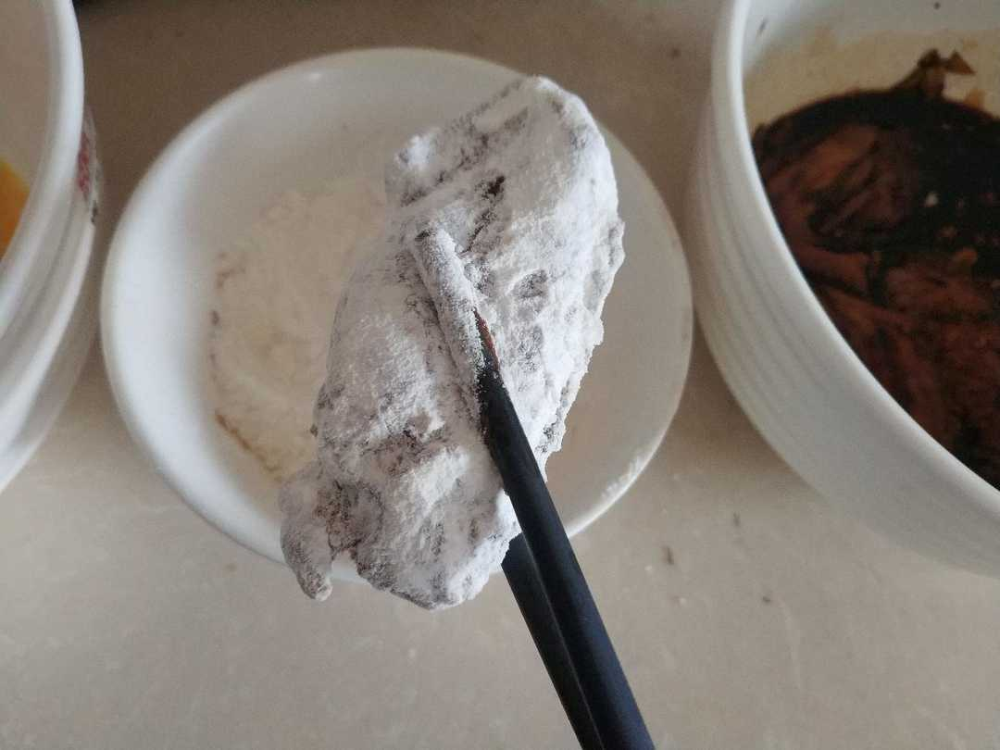
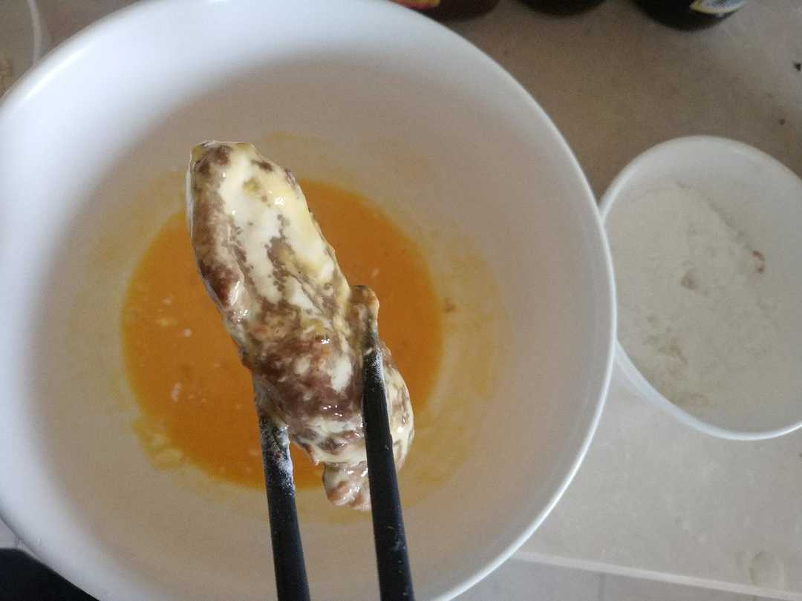
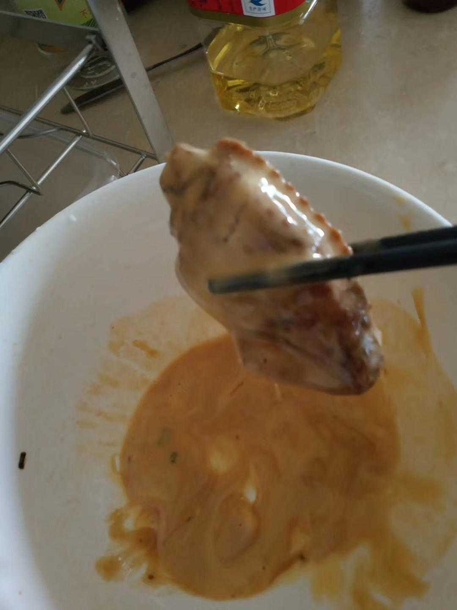
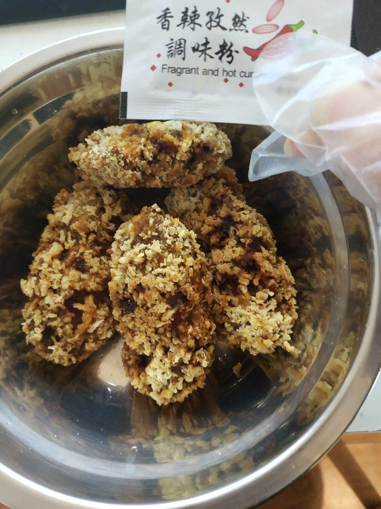

鸡翅先用水煮至发白，基本上处于半熟的状态

然后捞出来，放入碗中
用筷子或者牙签，戳出各种小洞

放入蒜姜葱沫，倒入酱油酒调味料
泡几个小时

此时鸡翅湿透，滚一层面粉  

然后在面粉外面再滚一层鸡蛋  

----------------------------------------------------------------------
或者鸡蛋面粉糊成糊，再滚一滚  

----------------------------------------------------------------------

再滚一层面包糠  

小火油锅炸至外层金黄色即可  

最后嘛  
