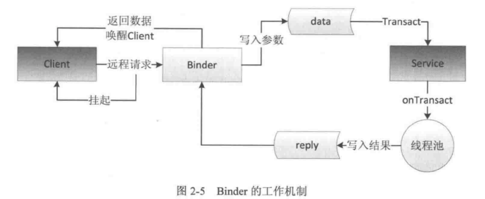

搜 Android bander 的设计


```java
getCallingUid //
```

Java类层中的IBinder 实现类

在framework 层是各种ServiceManager 链接Manager 和 ManagerService 之间的桥梁

在app 层是client / server 结构的媒介

虚拟设备中的 dev/binder


以AIDL 为示例：

```java
asInterface // 返回接口实例，stub or proxy
asBinder //
onTransact // 通过标识code 关联方法，返回false 则请求失败

```


客户端发起远程请求的时候，当前线程会被挂起，直到服务端返回结果

binder



死亡回调：deathRecipient

Client, Server, Service Manger 运行在用户空间，Binder 运行在内核空间。