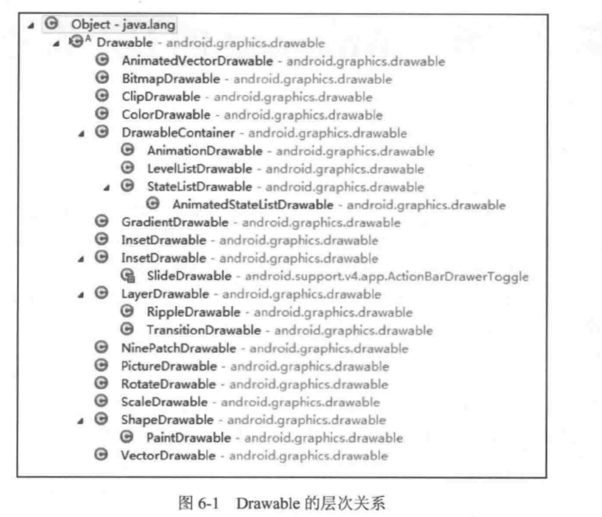

BitmapDrawable: 图片引用

Nibe-PathDrawable ： .9图，和Bitmap基本一致

LayerDrawable: 其他Drawable 数组，可以设置间距

StateListDrawable: 对应state

LevelList : 对应等级值

Transition :  两个drawable 切换渐变效果

Inset : 内嵌drawable ，可以设置间距

Clip : 裁剪

Scale : 变化大小

Shape :  几何图形（色彩渐变）

**自定义drawable**

