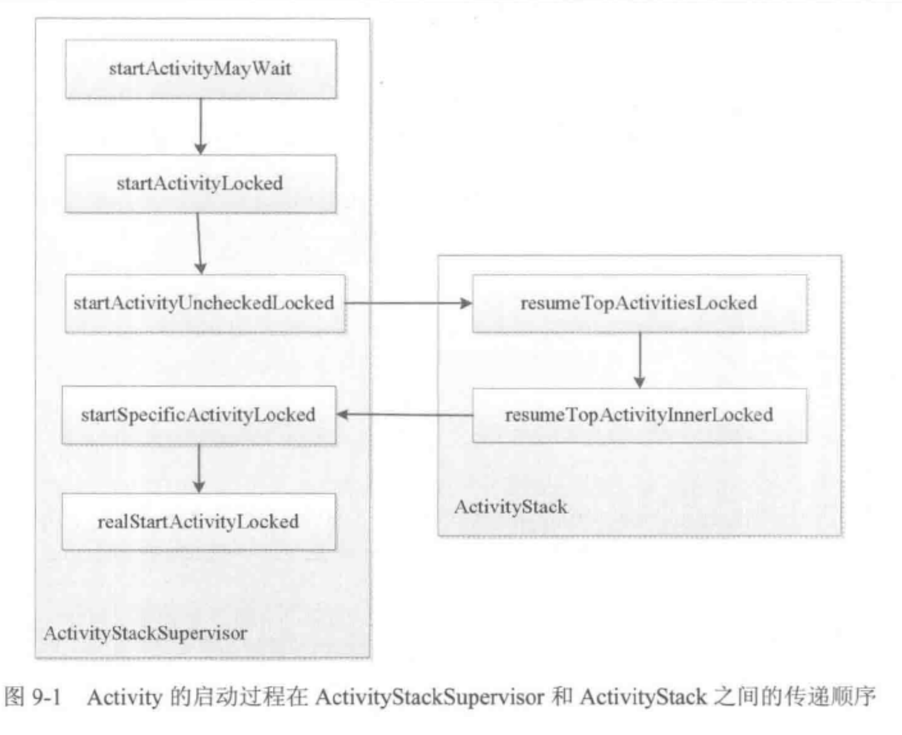

生命周期：onSaveInstanceState, onRestoreInstanceState

启动模式：

- standard，单独任务栈，applicationContext 没有栈信息
- singleTop,  栈顶复用，走onNewIntent
- singleTask,  栈内复用，指定栈（taskAffinity），clearTop
- singleInstance,  栈内复用，单独栈

`adb shell dumpsys activity ` 主要查看`TaskRecord`

启动模式中，launchMode 和 task 相关的判断在Activity 启动流程中，可以搜罗升阳 

代码设置flag 也行，有个不太常用的：FLAG_ACTIVITY_EXCLUDE_FROM_RECENTS

PackageManager.queryIntent ... Intent.resolve

启动activity 的请求会由Instrumentation 处理，然后通过Binder 向AMS 发送请求，AMS 维护的ActivityStack维护Activity 栈，通过ActivityThread  同步Activity 的状态从而完成生命周期方法的调用。

ActivityStack.resumeTopActivityInnerLocked 中会先pause 栈顶Activity，然后新的Activity 启动。

启动流程：

ActivityThread , ApplicationThread

execStartActivity， checkStartActivityResult（检查xml） --> ActivityManagerNative**.**getDefault().startActivity

获取default 实例化过程实际上是通过 ServiceManager 构造一个ActivityService（即一个binder），再传递给ActivityManagerNative 获取对应的实例，即AMS

然后**AMS.**startActicity -> **ActivityStackSupervisor**.startActivityMayWait -> startActivityLocked -> startActivityUnchekedLocked -> **ActivityStack.**resumeTopActivityLocked -> resumeTopActivityInnerLocked -> **ActivityStackSupervidor**.startSpecificActivityLocked -> realStartActivityLocked

此时调用 `app.thread.scheduleLaunchActivity` ，

注意app.thread 是一个binder， 实现了大量的Activity 停止、启动相关的操作。实现类就是ApplicationThread，继承自ApplicationNative，实现了IApplicationThread

此时即调用 applicationThread.scheduleLaunchActivity，里面就是简单的发送handler 消息给ActivityThread.H。而后由H 的消息处理，调用handleLaunchActivity -> performLaunchActivity

perform 主要完成：

- 从ActivityClientRecord 中获取待启动的activity的组件信息
- 通过Instrumentation 的newActicity 方法使用类加载器创建Activity 对象
- 通过LoadedApk 的makeApplication 方法来尝试创建 Application 对象
- 创建ContextImpl 对象并通过Activity 的attach 完成一些数据的初始化（包括context的关联，window的创建和关联）
- 创建后Instrumentation.callApplicationOnCreate

