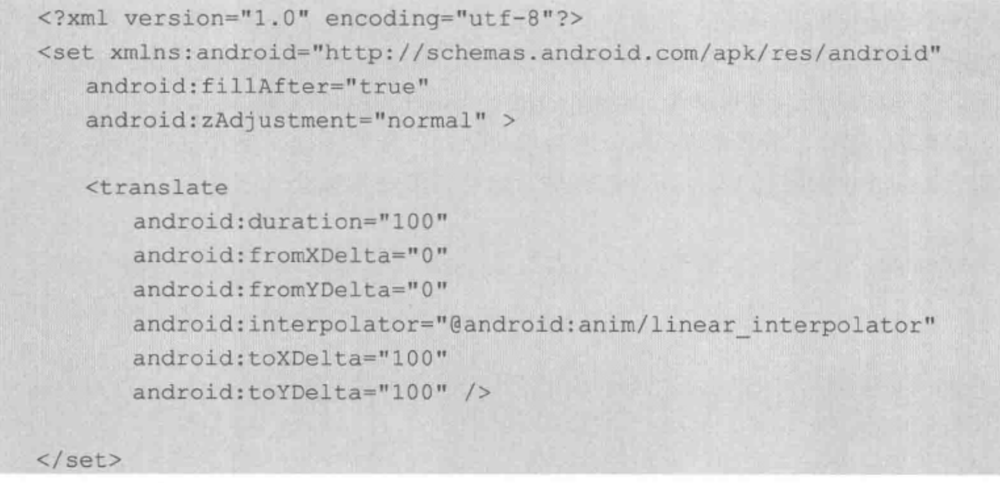
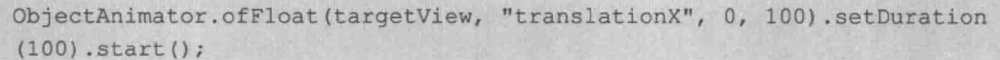

效果一般为：平移，缩放，旋转，透明度  

**View动画**
TranslateAnimation,Scale...,Rotate...,Alpha...  
AnimationUtils

**自定义动画**  
initialize,applyTransformation  
Camera 矩阵变化  

**帧动画**，注意内存    

**布局加载效果**
LayoutAnimation  
作用于ViewGroup,给每个子View增加过场效果

**activity切换效果**  
overridePendingTransition，需要在startActivity或者finish之后调用   

**fragment切换效果**  
fragmentTransaction, setCustomAnimations  

**属性动画：**
ValueAnimator,Object...,AnimatorSet

**插值器**：Interpolator  
估值器：Evaluator  

AnimatorListenerAdapter  
AnimatorUpdateListener  

属性动画的修改，必须提供set和get的方法。比如textView的width，其setWidth对应的并非layout_width，所以会无效。  