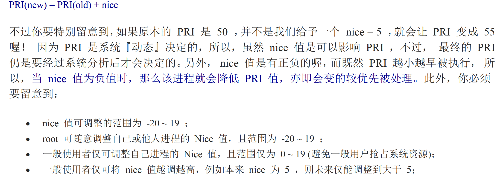

shell 客户端在 `/et/shells` , 登录时使用哪个shell 的配置在`etc/passwd` 

命令搜索顺序：指令路径、alias、bash内建、$PATH


在命令的最后使用`&` 可以让当前命令在后台进行，而不阻塞窗口


bash 的历史指令在 `.bash_history`， 数量由HISTSIZE 变量设定，`history` 查看记录

```shell
!<n> # 执行history中第n笔指令
!<command> # 执行”开头为command“的最近的指令
!! # 执行上一个指令
```


`alias` `unalias`


`type` 查找命令是否是内建指令

`ctrl+u` 光标处向前删除，`ctrl+k` 光标向后删除

`ctrl+a` 光标移动到最前，`ctrl+e` 光标移动到最后

`/` 换行

`echo` 显示变量， `unset` 删除变量

```shell
echo $$ # 显示当前PID
echo $? # 显示之前命令的返回结果，成功一般为0
```


`export` 查看所有环境变量，后跟变量则设置成环境变量， `env` 查询环境变量

`set` 显示所有变量（包括环境变量）

`declare/typeset` 

```shell
$ path = ${PATH}

${path#/*local/bin:} # 从前删除最短的符合条件的 /*/local/bin: ,`##` 删除最长的，`%``%%`从后
${path/sbin/SBIN} # 将path 的sbin 替换成SBIN，一次
${path//sbin/SBIN} # 将path 的sbin 替换成SBIN，所有
${path-defaultValue} # 如果path 没有值，则在读取的时候显示 defaultValue
${path:defaultValue} # 如果path 没有值或是空字符串，则在读取的时候显示 defaultValue
```


“ ” 表示原始字符串，''表示普通字符串

 命令嵌套：`version = $(uname - r)`, 或者使用`` 包裹


随机数获取 `declare -i number=$RANDOM*10/32768 ; echo $number` 


`PS1` 命令，man bash 可以查看，PROMPTING 小节，可以设置命令提示

`locale` 本地编码，/usr/lib/locale/ , /etc/locale.conf  


`read` 用户输入变量

`declare` 可以指定变量属性

```shell
sum = 100+300+50
echo ${sum} # 结果是”100+300+50“

declare -i sum = 100+300+50
echo ${sum} # 结果是”450“
```


`ulimit` 用户系统资源使用限制


进入tty 的时候会显示欢迎内容，是在/etc/issue (远程登录时/etc/issue.net)里配置的，具体语法可以看man issue 配合man agetty

或者用root 修改/etc/motd ，这样所有人登录之后都会显示


login shell读取的配置文件包括，

- 系统整体设定 /etc/profile ,
- 个人设定，三者按顺序优先取一个 ~/.bash_profile， ~/.bash_login，~/.profile

在修改这些文件的时候，需要注销再登入才会生效。

注销bash 的时候，会先执行~/.bash_logout 里的指令


使用`source` 指令可以重新加载文件，小技巧是写多个配置文件在不同时候用

```shell
source ~/.bashrc
. ~/.bashrc # 等同上面的命令
```


`stty` 设置tty 的环境


bash 通配符：

- `*` 代表0到无穷多 任意字符
- `?` 代表起码有一个 任意字符
- `[]` 可能选项
- `[-]` 可能区间选项
- `[^]` 不可能选项

特殊符号 `#`, `\`, `|`, `;`, `~`, `$`, `&`, `!`, `/`, `>,>>`, `<,<<`, `''`, `""`, `()`, `{}`, `` 


重定向

`1>>`, `2>>`

将信息重定向到/dev/null 会使其被丢弃

```shell
# 将正确信息和错误信息写入同一个文件
1>&2
> list 2>&1
&> list
```


指令之间`&&` 和 `||` 也可以


管线`|` 

前面的标准（正常）输出结果，被后者当做标准输入

 

`last` 查看之前的登录记录


`cut` 分割一行字符串，提取需要的部分

`grep` 分析一行字符串，如有需求的部分，则提取整行


`sort` 排序

`uniq` 去除重复，配合排序使用

`wc` 数据统计，多少行、字


`tee` 将数据同时分流到文件和屏幕

`tr` 对数据中的文字进行删除或替换

`col` 将数据中的tab 转化成对等的空格

`join` 将两个文件的数据合并起来，以第一字段为关联依据

`paste` 直接将两个文件的行合并起来

`expand` 将按键转化成空格键

`split` 拆分文件为更小的多个文件


`xargs` 将数据按空格分隔，当做参数；可控制次数和每次传递的数量

`id` 查询用户的uid、gid 信息


```shell
# 减号`-` 的使用
tar -cvf - /home | tar -xvf - -C /tmp/homeback

前面的 - 表示命令结果保存在stdout，然后经过管线，传递给后面命令的 - ；这样不需要在写文件名
```


`mkisofs` 创建iso

`cdrecord` 刻录到硬件


`dd` 直接从扇区的内容进行备份

`cpio` 可以备份任何东西，包括装置设备文件；必须要重定向


`sed`(stream editor) 将数据进行取代、删除、新增、截取等操作


`nl` 展现数据包含行号


`printf` 打印格式控制，可以转化数字和ASCII

`awk` 分析数据后，每行的信息会保存在 NF（字段数），NR（第几行），FS（分隔符） 这三个变量中

```shell
last -n 5 | awk '{print $1 "\t" $3}' # 打印每行第1、第3字段
cat /etc/passwd | awk 'BEGIN {FS=“:”} $3 < 10 {print $1 "\t" $3}' # 冒号分割的，第三字段小于10
```


`diff` 以行为基准对比文件

`cmp` 以字节为准对比文件

 `patch` 对diff 的文件做补丁之后，可以应用

`pr` 打印文件


`bc` 浮点数计算

`tr` 大小写转化


```shell
ps -l  # 查阅自己bash 进程的数据

F 为flag, 权限标志，4表示root，1表示此子进程仅进行fork 而没有exec
S 为status，状态标志，R为running，S为sleeping（idle，signal），D（不可唤醒的睡眠状态，如等待i/o）,T为stop，Z为zombie 
C 为CPU，消耗百分比
PRI/NI，priority/nice，优先级，越小越容易被执行
ADDR/SZ/WCHAN，ADDR 是内核函数，指出进程在内存的部分，如果是运行中的进程，会显示-；SZ 为size，表示用掉多少；WCHAN，表示目前进程是否运作中

ps aux  # 查看所有系统的数据

VSZ，virtual size，占用的虚拟内存数量
RSS，占用的固定的内存量
```

`top` 动态更新进程状态，P键 按CPU 排序，M键 按MEMORY 排序

`pstree` 进程树

`kill - l` `man 7 signal` 

`kill <-signal> <pid>` 

`killall` 




`nice` `renice`

`free` 观察内存使用情况

`uname` 输出系统和核心相关信息

`uptime` 观察系统启动时间和工作负荷

`netstat` 追踪网络或socket文件

`dmesg` 分析核心产生的数据

`vmstat` 侦测系统资源变化

`/proc/*` 记录运行中的内存数据

`fuser` 查找正在使用某个文件的进程

`lsof` 查找某个进程开启的文件

`pidof` 找出某个正在执行的程序的pid


SELinux (Security Enhanced Linux) 

DAC（Discretionary Access Control）自主式

MAC（Mandatory Access Control）委托式


