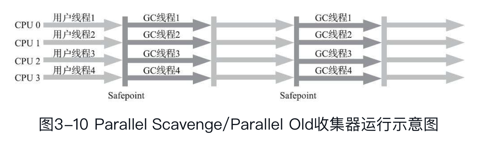

垃圾收集器的选择问题，从Shenandoah之后略过。

经典垃圾收集器是指：JDK7 update4 之后（此时G1 才正式商用，而非实验状态），JDK 11发布之前，OracleJDK 的HotSpot 虚拟机所包含的全部可用的垃圾收集器。

并行（Parallel）：并行描述的是多条垃圾收集器线程之间的关系，说明同一时间有多条这样的线程在协同工作，通常默认此时用户线程是处于等待状态。

并发（Concurrent）：并发描述的是垃圾收集器线程与用户线程之间的关系，说明同一时间垃圾收集器线程与用户线程都在运行。由于用户线程并未被冻结，所以程序仍然能响应服务请求，但由于垃圾收集器线程占用了一部分系统资源，此时应用程序的处理的吞吐量将受到一定影响。

追求最短停顿、追求吞吐量、追求超出内存分配速度的垃圾收集

**Serial 收集器**

新生代，单线程收集，且"stop the world"

停顿的问题，任何一款收集器都无法彻底消除（不讨论RTSJ 中的收集器），只是做了更多优化

Serial 的优点是简单高效，所以依旧是HotSpot 的默认收集器。而且在一两百兆新生代对象的收集情况下，停顿会被控制在百毫秒以下，是可以接受的。

（适用桌面应用）

**ParNew 收集器**

serial 的并行版本

（适用JDK7 之前的服务端）

**CMS(Concurrent Smark Sweep)**

老年代，首次实现并发，标记-清除。

但是标记分为多个步骤（前两种标记依旧需要”Stop the world“）：

- 初始标记：标记GC Roots 直接关联的对象，速度快
- 并发标记：标记GC Roots 直接关联对象的引用链
- 重新标记：标记并发期间，变化的记录（增量更新）
- 并发清除：清理掉标记后判断为死亡的对象。因为不是整理，所以也可以做到并发

缺点：

资源敏感；无法处理浮动垃圾（清除时新产生的）；碎片问题

**Parallel Scavenge 收集器**

新生代，标记-复制，并行收集，类似ParNew, 但是关注点不同

CMS等收集器的关注点在于缩短用户线程的停顿时间，而Parallel Scavenge 收集器的目标则是达到一个可控的吞吐量（`吞吐量  = 运行用户代码时间 / (运行用户代码时间 + 运行垃圾收集时间)`）。

有自适应参数：监控系统参数自动指定 新生代大小、Eden/Survivor 比例、老年代大小

**Serial Old 收集器**

Serial Old 收集器**

Serial 老年代版本

JDK5 之前与Parrallel Scavenge 搭配使用；或者在CMS 并发模式失败时使用

**Parrallel Old 收集器**

Parrallel Scavenge 老年代版本

**G1(Garbage First)**

全堆，开创了收集器面向局部收集的设计思路和基于Region 的内存布局形式

G1不再坚持固定大小以及固定数量的分代区域划分，而是把连续的Java堆划分为多个大小相等的独立区域（Region），每一个Region都可以根据需要，扮演新生代的Eden空间、Survivor空间，或者老年代空间。收集器能够对扮演不同角色的Region采用不同的策略去处理

Region 中有一类特殊的Humongous区域，专门用来存储大对象。大多数情况Humongous区域被作为老年代处理。

而整体的收集思路则是根据”经验“维护一个优先级列表，先收集价值收益最大的Region

同样的会有很多问题需要妥善处理：跨Region引用；

G1从整体来看是基于“标记-整理”算法实现的收集器，但从局部（两个Region之间）上看又是基于“标记-复制”算法实现

当然为了实现这些额外的功能，为了垃圾收集产生的内存占用（Footprint）还是程序运行时的额外执行负载（Overload）都是比较高的

**低延迟收集器**

除了内存占用（FootPrint）和吞吐量(Throughput)，还有一个衡量收集器完善程度的指标，即延迟度(Latency)

**Shenandoah**

最重要的当然是支持并发的整理算法

使用“连接矩阵”（Connection Matrix）替代记忆集的数据结构来计入Region 跨域引用

“Brooks Pointers”的转发指针

**ZGC（Z Garbage Collector）**

ZGC收集器是一款基于Region内存布局的，（暂时）不设分代的，使用了读屏障、染色指针和内存多重映射等技术来实现可并发的标记-整理算法的，以低延迟为首要目标的一款垃圾收集器

染色指针技术（Colored Pointer

1.3 之前，Serial 是唯一选择

1.4.0 出现Parallel Scavenge 收集器，

1.5.0 出现CMS 收集器，但是只能和Serial \ ParNew 配合工作

jdk 6 Parrallel Old

jdk9 G1 被设置为默认，CMS 的新生代不再可配置，而固定为ParNew

Jdk11 zgc

停顿时间越短就越适合需要与用户交互或需要保证服务响应质量的程序，良好的响应速度能提升用户体验；而高吞吐量则可以最高效率地利用处理器资源，尽快完成程序的运算任务，主要适合在后台运算而不需要太多交互的分析任务

停顿时间模型 (Pause Prediction Model）的意思是能够支持指定在一个长度为M毫秒的时间片段内，消耗在垃圾收集上的时间大概率不超过N毫秒这样的目标，这几乎已经是实时Java（RTSJ）的中软实时垃圾收集器特征了。

---

不可能三角