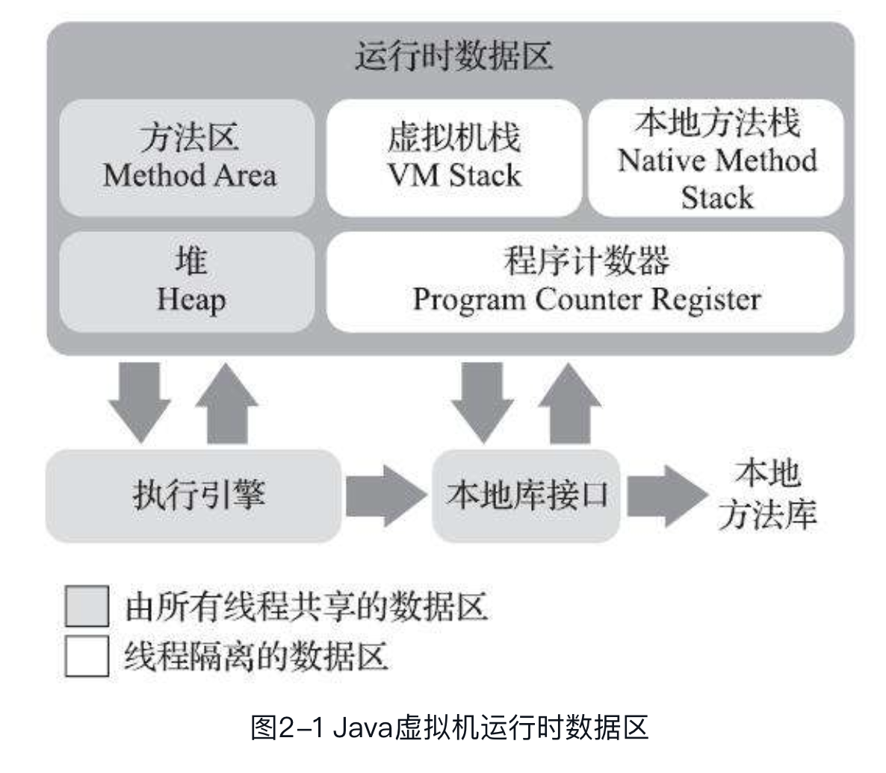

- 程序计数器

    较小的内存空间，当前线程所执行的字节码（如果是native方法，值为undefined）的行号指示器，程序控制流。

- 虚拟机栈

    每个java方法执行的时候，都会同步创建一个栈帧（Frame）用于存储存储局部变量表、操作数栈、动态连接、方法出口等

    局部变量表，包括基本数据类型、对象引用、returnAddress类型的数据。这些数据除了long\double 占用两个变量槽（Slot），都是占用一个。且所占内存空间在编译期间完成分配。

- 本地方法栈

    类似虚拟机栈，只是针对native 方法

- Java 堆

    几乎所有的对象实例都在这里分配（原文是所有的对象实例和数组都应当在堆上分配）

    同时是垃圾收集器管理的内存区域对象，从分配角度看，这里会划分出线程私有的分配缓冲区（Thread Local Allocation Buffer, TLAB）

- 方法区

    存储已被虚拟机加载的”类型“信息（类名、访问修饰符）、常量、静态变量、即时编译器编译后的代码缓存等数据

    - 编译时常量：Class 文件中除了有类的版本、字段、方法、接口等描述信息外，还有一项信息是常量池表，用于存放编译期生成的各种字面量与符号引用

    - 运行时常量：

        String.intern()

- 直接内存

    并不是虚拟机运行时数据区的一部分，也不是《Java虚拟机规范》中定义的内存区域。但是这部分内存也被频繁地使用，而且也可能导致OutOfMemoryError异常出现。在JDK 1.4中新加入了NIO（New Input/Output）类，引入了一种基于通道（Channel）与缓冲区（Buffer）的I/O方式，它可以使用Native函数库直接分配堆外内存，然后通过一个存储在Java堆里面的DirectByteBuffer对象作为这块内存的引用进行操作。这样能在一些场景中显著提高性能，因为避免了在Java堆和Native堆中来回复制数据。显然，本机直接内存的分配不会受到Java堆大小的限制，但是，既然是内存，则肯定还是会受到本机总内存（包括物理内存、SWAP分区或者分页文件）大小以及处理器寻址空间的限制，一般服务器管理员配置虚拟机参数时，会根据实际内存去设置-Xmx等参数信息，但经常忽略掉直接内存，使得各个内存区域总和大于物理内存限制（包括物理的和操作系统级的限制），从而导致动态扩展时出现OutOfMemoryError异常

除了程序计数器，在虚拟机规范中都有规定抛出OutOfMemoryErro

**内存溢出分析**

OutOfMemoryError 异常是实际应用中最常见的内存溢出异常情况

- 堆溢出

    堆栈信息 `java.lang.OutOfMemoryError` 会跟随进一步提示`Java heap space`

    此时首先需要分析

    常规方法先dump 出堆转储快照，再通过内存映像分析工具判断，是内存泄漏还是内存溢出问题

    如果是内存泄漏，可以查看泄漏对象到GC Roots 的引用链，找出泄漏原因

    如果不是泄漏，那就是必须对现有的对象生命周期进行优化，对象结构进行优化

- 栈溢出

    对应StackOverFlowError, OutOfMemoryError

    减少栈帧大小，增加分配内存大小。

- 方法区和常量池溢出

    OutOfMemoryError 后面会跟随提示`PermGen space`

- 本机直接内存溢出

    一个明显的特征是在Heap Dump文件中不会看见有什么明显的异常情况，发现内存溢出之后产生的Dump文件很小，而程序中又直接或间接使用了DirectMemory（典型的间接使用就是NIO），那就可以考虑重点检查一下直接内存方面的原因了。

CGLib 操作字节码在运行时生成大量的动态类

OSGi 

