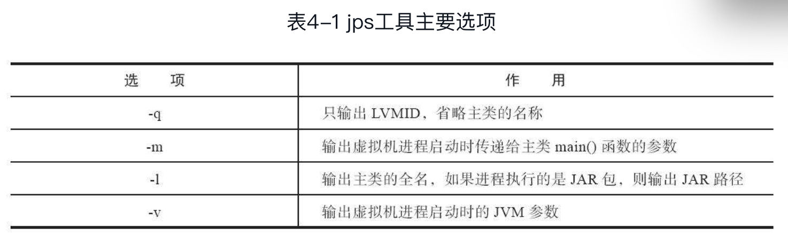

不限于异常堆栈、虚拟机运行日志、垃圾收集器日志、线程快照（threaddump/javacore文件）、堆转储快照（heapdump/hprof文件）等

**基本**

商业授权工具：主要是JMC（Java Mission Control）及它要使用到的JFR（Java FlightRecorder) ,

正式支持工具：比较稳定支持

实验性工具：一般而言功能稳定且强大，只是没有稳定的支持

LVMID，Local Virtual Machine Identifier

**命令行工具**

- jps（JVM Process Status Tool） 

    虚拟机进程状况工具

    

- jstat（JVM Statistics Monitoring Tool）

    监视虚拟机各种运行状态信息的命令行工具。显示虚拟机进程中的类加载、内存、垃圾收集、即时编译等运行时数据

    S 表示Survivor, E 表示Eden, O 表示Old，M 表示Meta，CCS 表示压缩空间占比，Y 表示Young, F 表示Full

    C 表示全部，U 表示Use, T 表示Time

- Jinfo（Configuration Info for Java）

    实时查看和调整虚拟机各项参数

- jmap（Memory Map for Java）

    用于生成堆转储快照（一般称为heapdump或dump文件），还可以查询finalize执行队列、Java堆和方法区的详细信息，如空间使用率、当前用的是哪种收集器

- jhat（JVM Heap Analysis Tool）

    分析jmap生成的堆转储快照

    分析内存泄漏问题主要会使用到其中的“HeapHistogram”（与jmap-histo功能一样）与OQL页签的功能，前者可以找到内存中总容量最大的对象，后者是标准的对象查询语言，使用类似SQL的语法对内存中的对象进行查询统计

- jstack（Stack Trace for Java）

    生成虚拟机当前时刻的线程快照（一般称为threaddump或者javacore文件）

    这个有点看不明白哈哈哈哈。

**可视化工具**

Hsdb，测试时使用 jdk13 下面的，第一次开启多次连接process 失败，一次连接的过程中卡死了。。。

然后重新启动，突然又能连接了。。看不懂

首先代码中创建对象引用，如Holder，然后用jps 查看vmid，用hsdb 连接，查看heap params，用console 的`scanoops` 查找堆范围内的引用对象地址，再用inspector 查看对应地址的对象地址。

JConsole（Java Monitoring and Management Console）

是一款基于JMX （Java Manage-ment Extensions）的可视化监视、管理工具。

主要通过MBean（ManagedBean）对系统进行信息收集和参数动态调整

VisualVM （All-in-One Java Troubleshooting Tool）

除了常规的运行监视、故障处理外，还将提供其他方面的能力，譬如性能分析（Profiling）

JMC（Java Mission Control）

可持续在线的监控工具

Hotspot 本身插件，存在于hotspot源码 hotspot/src/share/tools 目录下，其中
ClientCompilerVisualizer:查看C1即时编译器生成高级中间表示（HIR）转成低级中间表示(LIR)和物理寄存器分配的过程 

IdealGraphVisualizer:用于可视化展示C2即时编译器是如何将字节码转化为理想图。然后转化为机器码的

HSDIS: JIT 生成代码反编译，针对虚拟机即时编译代码

JITWatch：配合HSDIS 使用

其他作用不大。

一般不用jhat而用更优秀的VisualVM，Eclipse MemoryAnalyzer、IBM HeapAnalyzer 等