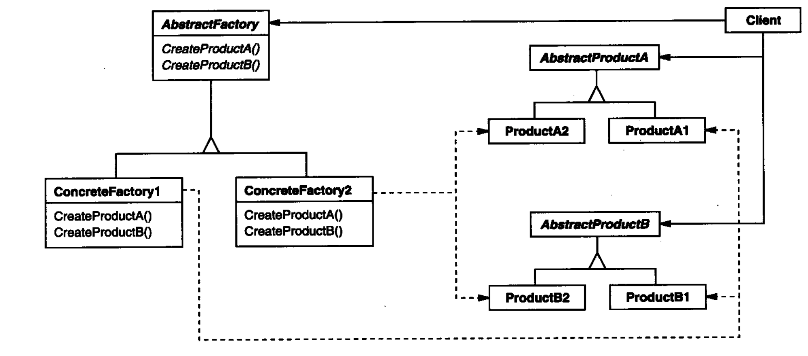

提供一个创建一系列相关或相互依赖对象的接口，而无需指定它们具体的类

一个类创建型模式使用继承改变被实例化的类

而一个对象创建型模式将实例化委托给另一个对象

看下图结构，明显看到其特点：

接口化创建的实例；对内部的组成有较明显关联

因为其特性，一般声明为全局单例。

> 可以将CreatePoductA() 里再添加一个“参数化工厂方法”。即通过增加判断参数，来减少工厂数量
>
> 为了减少类的生产，我们还可以对类似的实例进行转化，即"原型方法"。

这个模式的缺点很明显，就是每次添加一个Product，都需要在所有Factory类进行修改

