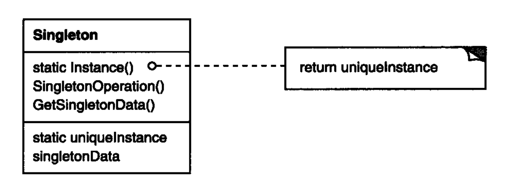

保证一个类仅有一个实例，并提供一个访问它的全局访问点




转载（文章已经没了）: [https://mp.weixin.qq.com/s?\_\_biz=MzA3MDMyMjkzNg==&mid=2652261637&idx=1&sn=f069445f9e5df982ecfd47c9d40cc016&scene=23&srcid=0414ZwGpJ1q2pmzxgCzXQJdq\#rd](https://mp.weixin.qq.com/s?__biz=MzA3MDMyMjkzNg==&mid=2652261637&idx=1&sn=f069445f9e5df982ecfd47c9d40cc016&scene=23&srcid=0414ZwGpJ1q2pmzxgCzXQJdq#rd)

单例模式可能是代码最少的模式了，但是少不一定意味着简单，想要用好、用对单例模式，还真得费一番脑筋。

本文对Java中常见的单例模式写法做了一个总结，如有错漏之处，恳请读者指正。

饿汉法

顾名思义，饿汉法就是在第一次引用该类的时候就创建对象实例，而不管实际是否需要创建。代码如下：

```java
public class Singleton { 
  private static Singleton = new Singleton(); 
  private Singleton() {} 
  public static getSignleton(){ return singleton; } 
}
```

这样做的好处是编写简单，但是无法做到延迟创建对象。但是我们很多时候都希望对象可以尽可能地延迟加载，从而减小负载，所以就需要下面的懒汉法：

单线程写法

这种写法是最简单的，由私有构造器和一个公有静态工厂方法构成，在工厂方法中对singleton进行null判断，如果是null就new一个出来，最后返回singleton对象。这种方法可以实现延时加载，但是有一个致命弱点：线程不安全。如果有两条线程同时调用getSingleton\(\)方法，就有很大可能导致重复创建对象。

public class Singleton { private static Singleton singleton = null; private Singleton\(\){} public static Singleton getSingleton\(\) { if\(singleton == null\) singleton = new Singleton\(\); return singleton; } }

考虑线程安全的写法

这种写法考虑了线程安全，将对singleton的null判断以及new的部分使用synchronized进行加锁。同时，对singleton对象使用volatile关键字进行限制，保证其对所有线程的可见性，并且禁止对其进行指令重排序优化。如此即可从语义上保证这种单例模式写法是线程安全的。注意，这里说的是语义上，实际使用中还是存在小坑的，会在后文写到。

public class Singleton { private static volatile Singleton singleton = null;

```text
private Singleton(){}

public static Singleton getSingleton(){
    synchronized (Singleton.class){
        if(singleton == null){
            singleton = new Singleton();
        }
    }
    return singleton;
}    
```

}

兼顾线程安全和效率的写法

虽然上面这种写法是可以正确运行的，但是其效率低下，还是无法实际应用。因为每次调用getSingleton\(\)方法，都必须在synchronized这里进行排队，而真正遇到需要new的情况是非常少的。所以，就诞生了第三种写法：

public class Singleton { private static volatile Singleton singleton = null;

```text
private Singleton(){}

public static Singleton getSingleton(){
    if(singleton == null){
        synchronized (Singleton.class){
            if(singleton == null){
                singleton = new Singleton();
            }
        }
    }
    return singleton;
}    
```

}

这种写法被称为“双重检查锁”，顾名思义，就是在getSingleton\(\)方法中，进行两次null检查。看似多此一举，但实际上却极大提升了并发度，进而提升了性能。为什么可以提高并发度呢？就像上文说的，在单例中new的情况非常少，绝大多数都是可以并行的读操作。因此在加锁前多进行一次null检查就可以减少绝大多数的加锁操作，执行效率提高的目的也就达到了。

坑

那么，这种写法是不是绝对安全呢？前面说了，从语义角度来看，并没有什么问题。但是其实还是有坑。说这个坑之前我们要先来看看volatile这个关键字。其实这个关键字有两层语义。第一层语义相信大家都比较熟悉，就是可见性。可见性指的是在一个线程中对该变量的修改会马上由工作内存（Work Memory）写回主内存（Main Memory），所以会马上反应在其它线程的读取操作中。顺便一提，工作内存和主内存可以近似理解为实际电脑中的高速缓存和主存，工作内存是线程独享的，主存是线程共享的。volatile的第二层语义是禁止指令重排序优化。大家知道我们写的代码（尤其是多线程代码），由于编译器优化，在实际执行的时候可能与我们编写的顺序不同。编译器只保证程序执行结果与源代码相同，却不保证实际指令的顺序与源代码相同。这在单线程看起来没什么问题，然而一旦引入多线程，这种乱序就可能导致严重问题。volatile关键字就可以从语义上解决这个问题。 注意，前面反复提到“从语义上讲是没有问题的”，但是很不幸，禁止指令重排优化这条语义直到jdk1.5以后才能正确工作。此前的JDK中即使将变量声明为volatile也无法完全避免重排序所导致的问题。所以，在jdk1.5版本前，双重检查锁形式的单例模式是无法保证线程安全的。

静态内部类法

那么，有没有一种延时加载，并且能保证线程安全的简单写法呢？我们可以把Singleton实例放到一个静态内部类中，这样就避免了静态实例在Singleton类加载的时候就创建对象，并且由于静态内部类只会被加载一次，所以这种写法也是线程安全的：

public class Singleton { private static class Holder { private static Singleton singleton = new Singleton\(\); }

```text
private Singleton(){}

public static Singleton getSingleton(){
    return Holder.singleton;
}
```

}

但是，上面提到的所有实现方式都有两个共同的缺点： 都需要额外的工作\(Serializable、transient、readResolve\(\)\)来实现序列化，否则每次反序列化一个序列化的对象实例时都会创建一个新的实例。 可能会有人使用反射强行调用我们的私有构造器（如果要避免这种情况，可以修改构造器，让它在创建第二个实例的时候抛异常）。

枚举写法

当然，还有一种更加优雅的方法来实现单例模式，那就是枚举写法：

public enum Singleton { INSTANCE; private String name; public String getName\(\){ return name; } public void setName\(String name\){ this.name = name; } }

使用枚举除了线程安全和防止反射强行调用构造器之外，还提供了自动序列化机制，防止反序列化的时候创建新的对象。因此，Effective Java推荐尽可能地使用枚举来实现单例。

总结

这篇文章发出去以后得到许多反馈，这让我受宠若惊，觉得应该再写一点小结。代码没有一劳永逸的写法，只有在特定条件下最合适的写法。在不同的平台、不同的开发环境（尤其是jdk版本）下，自然有不同的最优解（或者说较优解）。 比如枚举，虽然Effective Java中推荐使用，但是在Android平台上却是不被推荐的。在这篇Android Training中明确指出：

Enums often require more than twice as much memory as static constants. You should strictly avoid using enums on Android.

再比如双重检查锁法，不能在jdk1.5之前使用，而在Android平台上使用就比较放心了（一般Android都是jdk1.6以上了，不仅修正了volatile的语义问题，还加入了不少锁优化，使得多线程同步的开销降低不少）。

最后，不管采取何种方案，请时刻牢记单例的三大要点：

线程安全 延迟加载 序列化与反序列化安全

