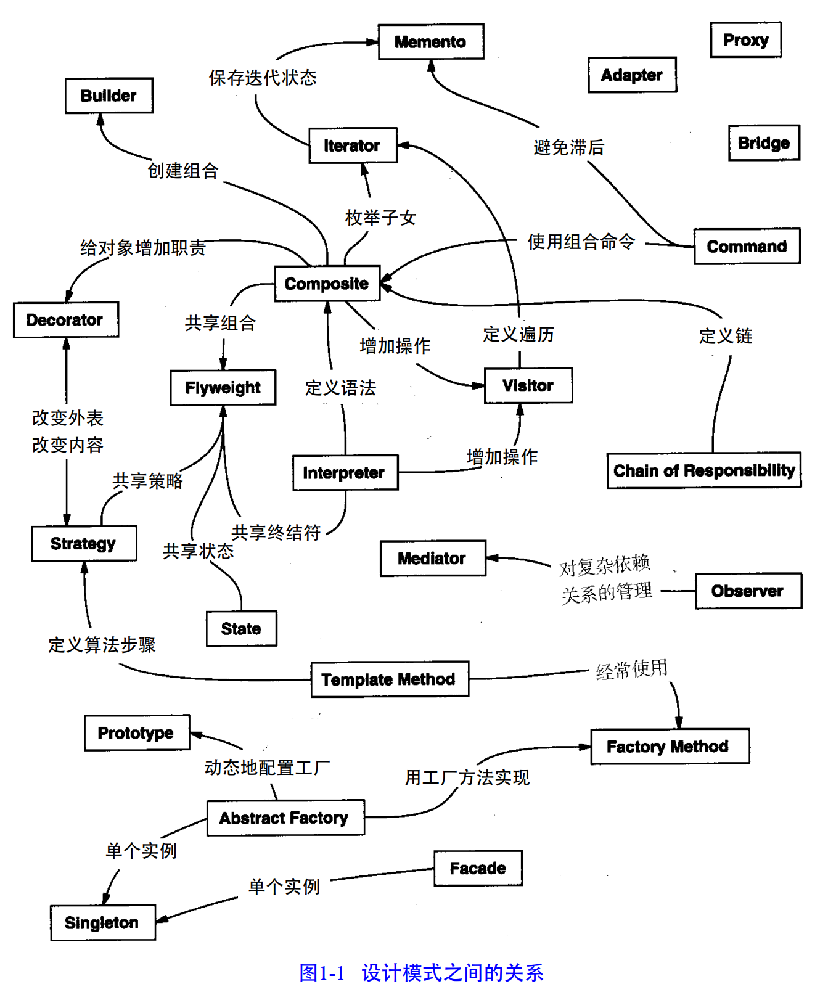

组合模式经常和迭代器或者访问者一起使用；

原型模式可以替代抽象工厂模式；

组合模式和装饰者模式的结构图非常相似

对象在大小和数目上变化极大。

外观模式描述了怎样用对象表示完整的子系统，
享元模式描述了如何支持大量的最小粒度的对象。其他一些设计模式描述了将一个
对象分解成许多小对象的特定方法。

抽象工厂模式和构建者模式产生那些专门负责生成其他对象的对象。 

访问者模式和命令模式生成的对象专门负责实现对其他对象或对象组的请求。

