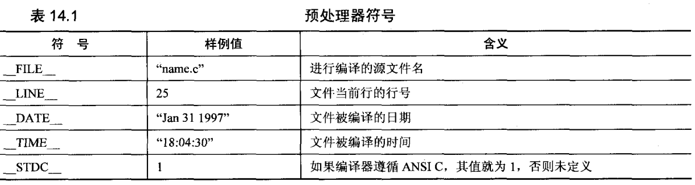

# 编译和运行

### 编译流程

源代码

=》（预处理器）预处理  

=》（编译器）解析 （判断语句合法性 -- 错误、警告）

=》（优化器）优化  （因为需要额外时间，所以上线才需要）

=》 目标代码 

=》 链接   

对应将源文件转化成机器代码

### 预处理器

预处理器会在源代码编译之前处理一些文本性质的操作：

[预处理](./pre-process/pre-process-index.md)

预处理器根据c标准实现下面这些预处理符号



### 编译链接

编译器如cc ; 在win的 ms-dos界面，叫做bcc 。当然还有很多，比如gcc

其支持的所有源文件格式参看 [c标准--拓展名](../overview/c-biao-zhun.md#tuo-zhan-ming-bu-fen)

以cc为例子，通用语法如下：

```bash
cc [-c] [-o outfileName] main.c other.c mid.o
# 
-lname #会在name函数库里查找（但是我看示例有 -lm，表示math 的缩写？）
```

先讲最直接的

```bash
cc main.c
```

会在目录下产生一个a.out文件，是可执行的；要修改文件名（包括拓展名），则启用 `-o`

但是实际上是先产生了一个main.o 的中间文件，然后再链接之后被自动删除\(可能不被删除，编译器决定\)

为了保留中间文件，可以添加 `-c`

这样可以在修改某一个文件的时候，直接使用其他没有修改的中间文件，减少时间。

#### 注意

如果修改了头文件，那么所有包含了这个头文件的文件都需要重新编译  

集成开发环境有自动处理这部分逻辑；

而make工具也是为了达到这个目的，不过需要makefile来描述文件组织。

#### win的不同

除了bcc的名称不同，中间文件默认是file.obj，而且有`-ename`选项命名执行文件为 "name.exe"

### 环境

上述的过程（源代码到机器指令）被称为翻译环境  

而实际执行代码的环境（执行环境）不一定和翻译环境相同（不在同一台机器上）  

同时还有独立环境（没有操作系统支持，如嵌入式）

这就需要交叉编译器

### 执行流程

* 载入到内存：不是存储在堆栈中的还没初始化的变量在这个时候得到初始值

> 操作系统完成这个任务；或者独立环境张，需要手工载入，比如把代码存入ROM

* 启动程序处理命令行参数并滴啊用main函数  
* 开始执行：此时有运行时堆栈，存储函数的局部变量和返回地址；以及存储静态内存
* 终止：正常退出或异常中断



### IDE

对于现在的开发工具，一般都已经集成的比较完善，我们了解下工具的选项：


