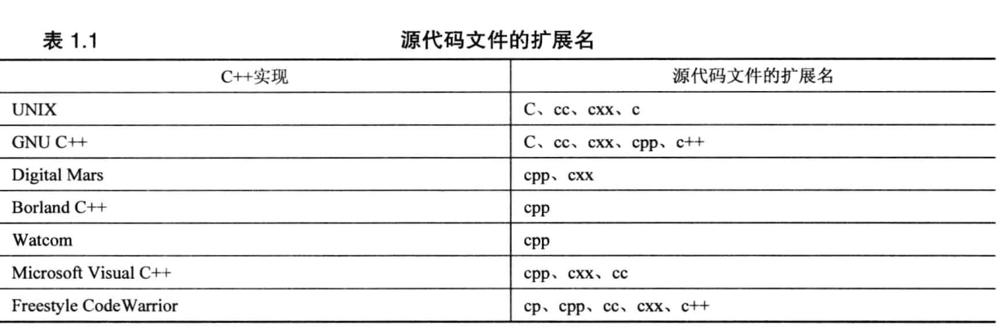

# c标准

最开始，C语言社区遵循一种事实标准，该标准基于Kernighan 和 Ritchie 编写的《The C Programming Language》， 通常被称为K&R C，在ANSI C出现后，又被称作经典C \( Classic C \)

ANSI C 标准：不仅定义了C语言，还定义了一个ANSI C实现必须支持的标准C库

最新的C标准为C99，ISO和ANSI 分别于1999年和2000年批准了该标准，主要添加了一些C++编译器支持的特性，如新的整形

\[这些标注的查询之处\]\([https://en.cppreference.com/w/c/io/fprintf](https://en.cppreference.com/w/c/io/fprintf)\)

### 拓展名部分

